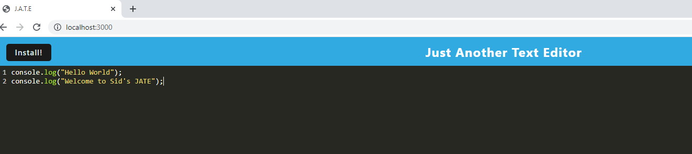

# Text Editor

## Your Task

This project covers J.A.T.E (ust another text editor). JATE is a text editor that runs in the browser. This is a single-page application that meets the PWA criteria. 

[](https://opensource.org/licenses/BSD-2-Clause)
## Table of Contents
1. [ User Story. ](#user_Story)
2.  [ Acceptance Citeria. ](#acceptance_criteria)
3.  [ Description. ](#description)
4. [ Installation. ](#installation)
5. [ Usage. ](#usage)
6. [ License. ](#license)
7. [ Screenshots. ](#screenshots)
8. [ Questions. ](#questions)
9.  [ Links. ](#links)
10. [ Resources. ](#resources)
11. 
## User_Story

```md
AS A developer
I WANT to create notes or code snippets with or without an internet connection
SO THAT I can reliably retrieve them for later use
```

## Acceptance_Criteria

```md
GIVEN a text editor web application
WHEN I open my application in my editor
THEN I should see a client server folder structure
WHEN I run `npm run start` from the root directory
THEN I find that my application should start up the backend and serve the client
WHEN I run the text editor application from my terminal
THEN I find that my JavaScript files have been bundled using webpack
WHEN I run my webpack plugins
THEN I find that I have a generated HTML file, service worker, and a manifest file
WHEN I use next-gen JavaScript in my application
THEN I find that the text editor still functions in the browser without errors
WHEN I open the text editor
THEN I find that IndexedDB has immediately created a database storage
WHEN I enter content and subsequently click off of the DOM window
THEN I find that the content in the text editor has been saved with IndexedDB
WHEN I reopen the text editor after closing it
THEN I find that the content in the text editor has been retrieved from our IndexedDB
WHEN I click on the Install button
THEN I download my web application as an icon on my desktop
WHEN I load my web application
THEN I should have a registered service worker using workbox
WHEN I register a service worker
THEN I should have my static assets pre cached upon loading along with subsequent pages and static assets
WHEN I deploy to Heroku
THEN I should have proper build scripts for a webpack application
```

## Installation
N/A
## Usage
N/A
## License
Free Use
## Screenshots




## Questions?
Want to see more of my work? [Github Link](https://github.com/https://github.com/SHD118/ReadMe-Generator#resources/credit)
<br/>
Want to learn more please contact me at shdesai118@gmail.com
## Links
https://github.com/SHD118/Text-Editor
https://guarded-lowlands-41872.herokuapp.com/
## Resources
https://developer.mozilla.org/en-US/docs/Web/Progressive_web_apps
https://developers.google.com/web/tools/lighthouse


